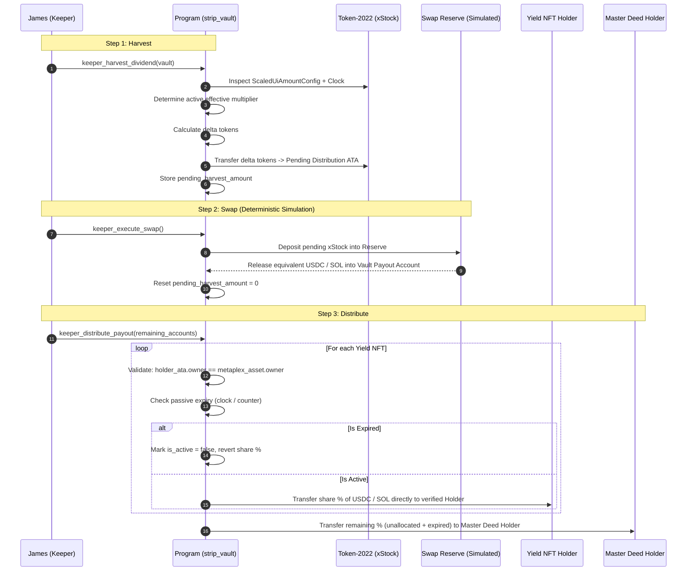

# Divvyr Smart Contract Architecture & Implementation Plan
**Program Name:** `strip_vault`  
**Framework:** Anchor  
**Key Standards:** Token-2022 (`ScaledUiAmountConfig`), Metaplex Core (`mpl-core`), Simulated Swap / Jupiter CPI  
**Conventions:** Solana Foundation `solana-dev` (Kit-first, `subject_verb_object`, reserved padding, Surfpool testing)

---

## 1. Overview & Objective

The `strip_vault` program enables holders of tokenized equities on Solana (e.g. xStocks) to:
1. **Lock underlying xStock tokens** in a vault PDA and receive a **Master Deed NFT** (Metaplex Core) representing 100% of the principal equity and all unallocated dividend rights.
2. **Carve out ("strip") future dividend streams** into one or more bearer **Yield NFTs** (Metaplex Core) with custom share percentages, passive expiry conditions, a pre-set SOL buyout price, and an embedded **Burn Delegate plugin** held by the Vault PDA.
3. **Execute a reliable 3-step dividend pipeline** (`harvest` $\rightarrow$ `swap` $\rightarrow$ `distribute`):
   - Reads the currently active Token-2022 multiplier (accounting for scheduled effective timestamps).
   - Converts the dividend slice into liquid USDC or SOL via a deterministic **Oracle/Reserve Swap Engine** (cleanly simulated for hackathon demo reliability, with production architecture ready for Jupiter CPI).
   - Distributes payouts directly to current NFT holders' verified wallets without manual claims.
4. **Enable early buyouts** where the Master Deed holder pays the pre-agreed SOL price to the current Yield NFT holder, allowing the Vault PDA to exercise its burn delegate authority to permanently shred the Yield NFT and restore full dividend rights to the vault.

---

## 2. Directory & File Structure

```
programs/strip_vault/
├── Cargo.toml
├── Xargo.toml
└── src/
    ├── lib.rs                               # Program entrypoints & declare_id!
    ├── errors.rs                            # Custom error codes
    ├── events.rs                            # Program events for indexer tracking
    ├── state/
    │   ├── mod.rs
    │   ├── vault.rs                         # Vault state struct, padding & methods
    │   └── yield_record.rs                  # YieldRecord struct, enums & expiry checks
    ├── instructions/
    │   ├── mod.rs
    │   ├── creator_initialize_vault.rs      # Lock stock & mint Master Deed NFT
    │   ├── owner_strip_position.rs          # Mint Yield NFT with BurnDelegate plugin & create YieldRecord
    │   ├── keeper_harvest_dividend.rs       # Step 1: effective timestamp check, delta calc, token move
    │   ├── keeper_execute_swap.rs           # Step 2: deterministic oracle/reserve swap (simulated)
    │   ├── keeper_distribute_payout.rs      # Step 3: passive expiry, holder verification & payout splits
    │   ├── owner_buyout_yield.rs            # SOL payment & Vault PDA delegated burn
    │   └── owner_redeem_principal.rs        # Burn Master Deed & unlock stock
    └── utils/
        ├── mod.rs
        ├── math.rs                          # Precision Scaled UI dividend calculations
        └── metaplex_core.rs                 # CPI helpers for Metaplex Core mint, burn delegate & burn
```

---

## 3. Section-by-Section Implementation Plan

---

### Phase 1A: State Architecture, Data Layout & Math Foundation

#### 1. The Multiplier Harvest Math (No Equity Dilution)
Token-2022's `ScaledUiAmountConfig` calculates UI tokens via:
$$\text{UI Amount} = \text{Raw Balance} \times \text{Multiplier}$$

When a company issues a dividend, the issuer updates the multiplier from $M_{\text{old}}$ to $M_{\text{new}}$ ($M_{\text{new}} > M_{\text{old}}$).  
To harvest the dividend value in raw tokens without reducing the original UI share count of the principal:

$$\text{Raw Tokens to Harvest} = \text{Current Raw Balance} \times \left(1 - \frac{M_{\text{old}}}{M_{\text{new}}}\right) = \frac{\text{Current Raw Balance} \times (M_{\text{new}} - M_{\text{old}})}{M_{\text{new}}}$$

**Verification Proof:**
- Initial: 100 raw tokens at $M_{\text{old}} = 1.00 \implies 100\text{ UI shares}$.
- Dividend declared: $M_{\text{new}} = 1.05 \implies \text{Value is now } 105\text{ UI shares}$.
- Dividend slice to harvest:
  $$\Delta = 100 \times \frac{1.05 - 1.00}{1.05} = 100 \times \frac{0.05}{1.05} \approx 4.761904\text{ raw tokens}$$
- Remaining in vault:
  $$100 - 4.761904 = 95.238096\text{ raw tokens}$$
- UI value of remaining tokens at $M_{\text{new}}$:
  $$95.238096 \times 1.05 = \mathbf{100.000000\text{ UI shares!}}$$
The principal position is 100% preserved.

#### 2. On-Chain State Layouts
Following the Solana Foundation's `solana-dev` standards:
- Fixed-size fields first for deterministic indexer `memcmp` offsets.
- Explicit `_reserved` padding for upgradeability without data migration.

```rust
// programs/strip_vault/src/state/vault.rs

use anchor_lang::prelude::*;

#[account]
pub struct Vault {
    // Fixed offsets for indexers
    pub stock_mint: Pubkey,                // 32 bytes - Token-2022 xStock mint
    pub stock_vault_ata: Pubkey,           // 32 bytes - Vault's Token-2022 holding account
    pub master_deed_asset: Pubkey,         // 32 bytes - Metaplex Core Asset ID for Master Deed
    pub payout_holding_ata: Pubkey,        // 32 bytes - ATA for USDC or Vault PDA for SOL
    pub total_raw_shares: u64,             // 8 bytes  - Total raw tokens deposited
    pub last_multiplier: u64,              // 8 bytes  - Multiplier at last harvest (scaled by 1e9)
    pub pending_harvest_amount: u64,       // 8 bytes  - Raw tokens in pending holding
    pub total_yield_allocated_bps: u16,    // 2 bytes  - Sum of active yield shares (max 10,000)
    pub payout_asset_type: PayoutAssetType,// 1 byte   - Usdc (0) or Sol (1)
    pub vault_bump: u8,                    // 1 byte
    pub vault_seed: u64,                   // 8 bytes  - Unique vault discriminator seed
    
    // Future expansion padding (Solana Foundation recommendation)
    pub _reserved: [u8; 64],
}

#[derive(AnchorSerialize, AnchorDeserialize, Clone, Copy, PartialEq, Eq)]
pub enum PayoutAssetType {
    Usdc,
    Sol,
}
```

```rust
// programs/strip_vault/src/state/yield_record.rs

use anchor_lang::prelude::*;

#[account]
pub struct YieldRecord {
    pub vault: Pubkey,                     // 32 bytes - Associated Vault PDA
    pub yield_asset_id: Pubkey,            // 32 bytes - Metaplex Core Asset ID
    pub buyout_price_lamports: u64,        // 8 bytes  - Fixed SOL buyout price
    pub share_bps: u16,                    // 2 bytes  - Percentage share (e.g., 2000 = 20.00%)
    pub payouts_received_count: u32,       // 4 bytes  - Number of payouts distributed
    pub is_active: bool,                   // 1 byte   - Active status
    pub bump: u8,                          // 1 byte
    pub expiry_condition: ExpiryCondition, // Enum variant + data
    
    // Future expansion padding
    pub _reserved: [u8; 32],
}

#[derive(AnchorSerialize, AnchorDeserialize, Clone, Copy, PartialEq, Eq)]
pub enum ExpiryCondition {
    None,
    Timestamp(i64),                        // Expiry unix timestamp
    PayoutCount(u32),                      // Maximum number of payouts to capture
}
```

#### 3. PDA Derivation Schemes
1. **Vault PDA:**  
   `seeds = [b"vault", stock_mint.key().as_ref(), &vault_seed.to_le_bytes()]`
2. **Stock Holding ATA:**  
   Associated Token Account owned by the Vault PDA for the `stock_mint`.
3. **Pending Distribution ATA:**  
   Token-2022 ATA owned by the Vault PDA:  
   `seeds = [b"pending", vault.key().as_ref()]`
4. **YieldRecord PDA:**  
   `seeds = [b"yield_record", vault.key().as_ref(), yield_asset.key().as_ref()]`
5. **Swap Reserve PDA (Simulated Liquidity Treasury):**  
   `seeds = [b"swap_reserve", vault.key().as_ref()]`

---

### Phase 1B: Position Stripping & Metaplex Core CPI

#### Instruction 1: `creator_initialize_vault`
- **Caller:** Vault Creator.
- **Actions:**
  1. Transfer `amount` of xStock tokens from creator's account to `stock_vault_ata` via Token-2022 CPI.
  2. Read current multiplier from `stock_mint` (Token-2022 `ScaledUiAmountConfig` extension).
  3. Mint **Master Deed NFT** using Metaplex Core CPI (`mpl_core::instructions::CreateV1` or `CreateV2`), with creator set as the initial owner.
  4. Initialize `Vault` state with `total_raw_shares = amount`, `last_multiplier = current_multiplier`, `total_yield_allocated_bps = 0`.

#### Instruction 2: `owner_strip_position`
- **Caller:** Signer holding the Master Deed NFT.
- **Constraints:**
  - Verify caller is current owner of `vault.master_deed_asset` on Metaplex Core.
  - Verify `vault.total_yield_allocated_bps + share_bps <= 10_000` (cannot exceed 100%).
- **Actions:**
  1. **Mint Yield NFT with Burn Delegate Plugin:**
     Mint a new **Yield NFT** via Metaplex Core CPI to the specified recipient.  
     **Crucial:** Attach the Metaplex Core `PermanentBurnDelegate` (or `BurnDelegate`) plugin with:
     ```rust
     Plugin::BurnDelegate(BurnDelegate {
         authority: PluginAuthority::Address { address: vault_pda },
     })
     ```
     This authorizes the Vault PDA to burn this NFT during a future buyout without requiring the current holder's live signature.
  2. Initialize `YieldRecord` PDA storing `share_bps`, `expiry_condition`, `buyout_price_lamports`.
  3. Update `vault.total_yield_allocated_bps += share_bps`.
  4. Emit `YieldStrippedEvent`.

---

### Phase 1C: The 3-Step Harvest & Payout Engine

To prevent exceeding the **1,232-byte Solana transaction limit** and guarantee bulletproof reliability on devnet, the dividend lifecycle is decoupled into three discrete instructions.



#### Step 1: `keeper_harvest_dividend`
- **Permissionless:** Can be called by any keeper.
- **Logic:**
  1. Unpacks `ScaledUiAmountConfig` from `stock_mint`.
  2. **Effective Multiplier Timestamp Check:**
     Solana's `ScaledUiAmountConfig` stores scheduled future updates. The contract verifies:
     ```rust
     let clock = Clock::get()?;
     let active_multiplier = if clock.unix_timestamp >= config.new_multiplier_effective_timestamp {
         config.new_multiplier
     } else {
         config.multiplier
     };
     ```
  3. Asserts `active_multiplier > vault.last_multiplier`.
  4. Calculates delta raw tokens using the exact formula from Phase 1A.
  5. Transfers delta raw tokens from `stock_vault_ata` to the vault's pending distribution ATA.
  6. Sets `vault.last_multiplier = active_multiplier` and `vault.pending_harvest_amount = delta_tokens`.

#### Step 2: `keeper_execute_swap` (Simulated Swap Engine)
- **Problem Solved:** Mock Token-2022 tokens have no real AMM liquidity pools on devnet, causing real Jupiter CPI route lookups to fail.
- **Mechanism:**
  - An on-chain deterministic **Swap Reserve / Fixed Oracle Rate Engine**.
  - Rate configured per vault or global oracle stub (e.g. $1\text{ mock stock} = 150\text{ USDC}$ or $1.2\text{ SOL}$).
  - Transfers `vault.pending_harvest_amount` of mock xStock tokens into the program's reserve account.
  - Releases the exact calculated value of USDC or native SOL from the reserve into the vault's payout account (`vault.payout_holding_ata` or PDA lamports).
  - Resets `vault.pending_harvest_amount = 0`.
- **Hackathon Narrative:**
  > *"Because live xStocks are KYC-gated, Divvyr demonstrates on a realistic Token-2022 mock token with a deterministic oracle-pegged swap reserve. In production, this instruction connects directly to Jupiter CPI routes."*

#### Step 3: `keeper_distribute_payout`
- **Logic:**
  1. Takes remaining accounts: pairs of `[YieldRecord PDA, Metaplex Core Asset Account, Holder ATA/Wallet]`.
  2. **Strict Holder Verification (Anti-Griefing):**
     Deserializes the Metaplex Core asset account and strictly checks:
     ```rust
     require_keys_eq!(
         recipient_wallet.key(), 
         metaplex_core_asset.owner, 
         StripVaultError::InvalidRecipientWallet
     );
     ```
     Funds can only ever land in the wallet that legitimately owns the Yield NFT.
  3. Evaluates **Passive Expiry**:
     - `ExpiryCondition::Timestamp(ts)`: if `Clock::get()?.unix_timestamp >= ts` $\rightarrow$ set `is_active = false`.
     - `ExpiryCondition::PayoutCount(max)`: if `payouts_received_count >= max` $\rightarrow$ set `is_active = false`.
  4. For active Yield NFTs:
     - Calculates payout: $\text{swapped\_total} \times \frac{\text{share\_bps}}{10000}$.
     - Transfers USDC or SOL directly to the current holder of the Metaplex Core asset.
     - Increments `payouts_received_count += 1`.
  5. Transfers remainder (unallocated % + any newly expired %) to the current owner of `vault.master_deed_asset`.

---

### Phase 1D: Buyout & Principal Redemption

#### Instruction: `owner_buyout_yield`
- **Caller:** Current holder of the Master Deed NFT.
- **Arguments:** None (takes `YieldRecord` PDA and Metaplex Core Yield Asset account).
- **Logic:**
  1. Verifies caller holds the Master Deed NFT.
  2. Verifies `YieldRecord.is_active == true`.
  3. Reads the current owner of the Metaplex Core Yield Asset account.
  4. Transfers `buyout_price_lamports` of native SOL from caller directly to the Yield NFT holder.
  5. **Delegated Burn Execution:**
     Because the Vault PDA was registered as the `BurnDelegate` during `owner_strip_position`, the Vault PDA signs the Metaplex Core `mpl_core::instructions::BurnV1` CPI. The Yield NFT is burned without requiring the holder's signature.
  6. Updates `YieldRecord.is_active = false`.
  7. Decrements `vault.total_yield_allocated_bps -= yield_record.share_bps`.
  8. Emits `YieldBoughtOutEvent`.

#### Instruction: `owner_redeem_principal`
- **Caller:** Current holder of the Master Deed NFT.
- **Constraints:**
  - `vault.total_yield_allocated_bps == 0` (all Yield NFTs have expired or been bought out).
- **Actions:**
  1. Burns Master Deed NFT via Metaplex Core CPI.
  2. Transfers all remaining xStock tokens from `stock_vault_ata` to caller.
  3. Closes vault accounts and returns rent to caller.

---

### Phase 1E: Error Codes & Invariants

```rust
// programs/strip_vault/src/errors.rs

use anchor_lang::prelude::*;

#[error_code]
pub enum StripVaultError {
    #[msg("Calculation overflow in dividend harvesting")]
    MathOverflow,
    #[msg("Current multiplier is not greater than the last recorded multiplier")]
    NoDividendDelta,
    #[msg("Total allocated yield cannot exceed 100% (10,000 bps)")]
    ExceedsMaxYieldAllocation,
    #[msg("Caller does not own the Master Deed NFT")]
    UnauthorizedMasterDeedHolder,
    #[msg("Yield position is already inactive or expired")]
    YieldPositionInactive,
    #[msg("Cannot redeem principal while active yield positions remain")]
    ActiveYieldPositionsRemain,
    #[msg("No pending dividend tokens to swap")]
    NoPendingHarvest,
    #[msg("Invalid Metaplex Core asset account")]
    InvalidAssetAccount,
    #[msg("Recipient wallet does not match the on-chain owner of the Yield NFT")]
    InvalidRecipientWallet,
}
```

---

## 4. Verification & Testing Playbook

### Testing Environment
- **Runner:** Surfpool (`NO_DNA=1 anchor test`)
- **Key Cheatcodes:**
  - Surfpool time-travel (`timeTravelToSlot` / `timeTravelToEpoch`): Fast-forward timestamps to test passive time expiry without waiting.
  - State manipulation: Mock Token-2022 multiplier configurations and balances.

### Test Matrix
| # | Test Scenario | Expected Outcome |
|---|---|---|
| 1 | `initialize_vault` with 1,000 mock shares | Stock transferred to vault ATA, Master Deed NFT minted to creator |
| 2 | `owner_strip_position` with 25% share (2500 bps) | Yield NFT minted with `BurnDelegate` plugin to recipient, `YieldRecord` created |
| 3 | Attempt second strip with 80% share (8000 bps) | Fails with `ExceedsMaxYieldAllocation` (2500 + 8000 > 10000) |
| 4 | Scheduled multiplier update with future timestamp | `keeper_harvest_dividend` ignores future update until clock reaches effective timestamp |
| 5 | Multiplier update effective; run `keeper_harvest_dividend` | Vault calculates 4.7619 tokens, moves to pending account, principal UI remains 1,000 |
| 6 | Run `keeper_execute_swap` | Deterministic swap converts pending tokens into USDC/SOL reserve holding |
| 7 | Run `keeper_distribute_payout` | Recipient receives 25% of payout, Master Deed holder receives 75% |
| 8 | Run `keeper_distribute_payout` with wrong recipient | Fails with `InvalidRecipientWallet` |
| 9 | Fast-forward clock past expiry; run `keeper_distribute_payout` | Yield position marked inactive, 100% of payout routes to Master Deed holder |
| 10| `owner_buyout_yield` on active Yield NFT | Pre-set SOL paid to holder, Vault PDA burns Yield NFT via delegate plugin, allocated bps decreases |
| 11| `owner_redeem_principal` after all positions unwind | Master Deed burned, full stock balance returned to owner |

---

## 5. Next Action
With this plan finalized:
1. Initialize the Anchor project workspace (`strip_vault`).
2. Implement **Phase 1A**:
   - `Cargo.toml` dependencies (Anchor 0.30/0.31, `mpl-core`, Token-2022).
   - `Vault` and `YieldRecord` account structs.
   - Multiplier math helper functions with comprehensive unit tests.
3. Proceed sequentially through **Phase 1B**, **1C**, and **1D**.
